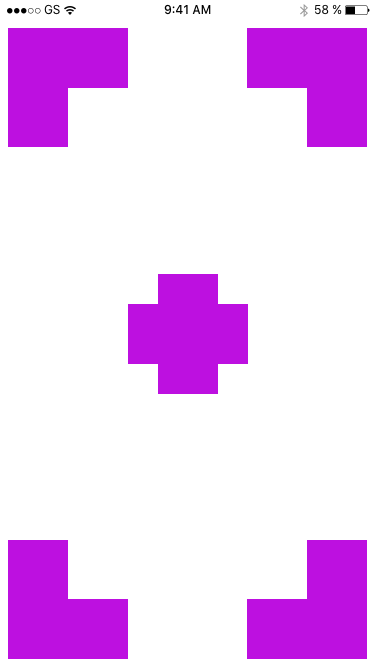
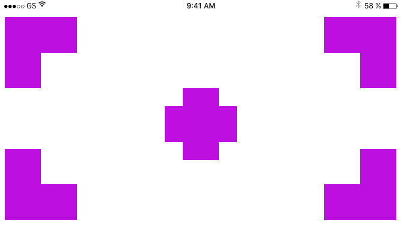
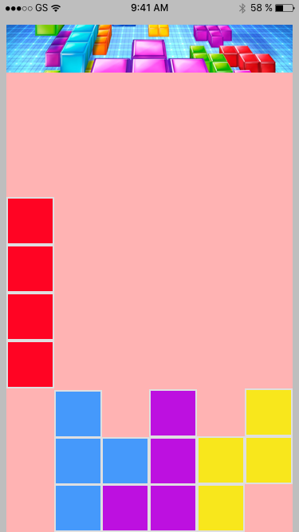
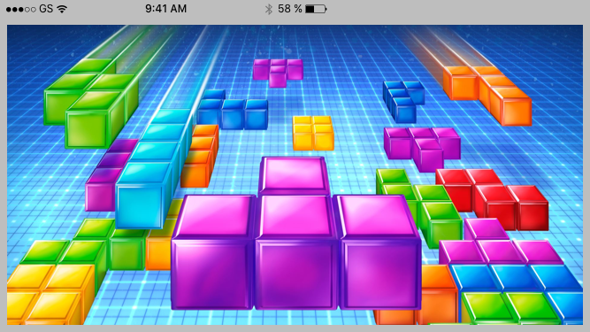

# AC3.2-Programmatic_Layout_Practice
---
### Objective

1. Practice programmatic autolayout
2. Examine how to programmatically layout scroll views
3. Practice setting up `self.window`

---
### Exercises

#### Camera Crosshairs

---

#### Tetras (definitely not Tetris)

